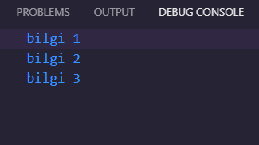

<h1><i>ASYNC</i></h1>

In this code example, two different functions are defined: bilgiGetir and bilgiGetir2. Both functions perform asynchronous operations within a specific time interval and print the results to the console.

